# 🛡️ SENTINEL - UI

**SENTINEL - UI** is a Chrome Extension designed to perform superficial, rapid checks for potential **OWASP Top 10 vulnerabilities** on any given website.

⚠️ **Disclaimer:** This tool performs *superficial heuristic checks only*. It is **not** a penetration testing tool and cannot replace comprehensive security audits.

---

## 🏗️ High-Level Structure

The extension follows the standard Chrome Extension **Manifest V3** architecture. It consists of three primary layers:
1. **The User Interface (Popup):** Provides the input interface, initiates scans, and displays results in a modern, dark-themed UI.
2. **The Logic Controller (Popup JS):** Acts as the bridge between the user interface and the background scanner, handling UI state and local storage.
3. **The Background Service Worker:** Performs the actual HTTP requests and URL heuristic checks securely in the background, circumventing standard cross-origin limitations where applicable via extension APIs.

---

## 📂 File Structure

```text
SENTINEL-UI/
│
├── manifest.json       # Extension configuration & permissions (Manifest V3)
├── background.js       # Service Worker handling the core scanning logic
├── popup.html          # UI Layout for the extension popup
├── popup.css           # Styling for the popup (Modern Dark Theme)
├── popup.js            # UI interaction logic and messaging bridging
│
└── icons/              
    └── icon.svg        # Custom shield icon for the extension
```

---

## ⚙️ Architecture & Flow Chart

The following diagram illustrates the data flow from the moment a user requests a scan to when the results are rendered on screen.

```mermaid
sequenceDiagram
    participant User
    participant PopupUI as Popup UI (HTML/CSS)
    participant PopupJS as Popup Logic (JS)
    participant Background as Service Worker
    participant TargetWeb as Target Website

    User->>PopupUI: Clicks "Scan" Button
    PopupUI->>PopupJS: Trigger Scan Event
    PopupJS->>PopupUI: Show Loading Spinner
    PopupJS->>Background: Send {action: 'scan_url', url}
    
    rect rgb(30, 41, 59)
    Background->>TargetWeb: 1. Fetch HEAD (for headers)
    TargetWeb-->>Background: Response Headers
    Background->>Background: 2. Analyze URL heuristics
    Background->>Background: 3. Parse headers for security flags
    end
    
    Background-->>PopupJS: Return Vulnerability Results Array
    PopupJS->>chrome.storage: Save Results locally
    PopupJS->>PopupUI: Hide Spinner & Render Vulnerability List
    PopupUI-->>User: Display Results
```



---

## 🚀 Installation & Setup

1. Clone or download this repository to your local machine.
2. Open Google Chrome and navigate to `chrome://extensions/`.
3. Enable **Developer mode** using the toggle switch in the top right corner.
4. Click on **Load unpacked** and select the `SENTINEL-UI` directory.
5. The extension is now installed! Click the puzzle icon in your browser to pin it to your toolbar.

---

## 📝 License

This project is licensed under the [MIT License](LICENSE).
