# 🛡️ SENTINEL - UI

**SENTINEL - UI** is an autonomous, AI-augmented Chrome Extension engineered to perform rapid, passive heuristic analysis for potential **OWASP Top 10 vulnerabilities** on any web application.

⚠️ **Disclaimer:** This tool utilizes *passive, observational telemetry only*. It is designed for preliminary reconnaissance and educational purposes, and is **not** a substitute for comprehensive penetration testing or active dynamic application security testing (DAST).

---

## 🏗️ High-Level Architecture

The extension is built on a high-performance **Manifest V3** architecture. It leverages a non-intrusive, continuous monitoring pipeline consisting of three primary layers:

1. **The Telemetry Engine (Content Script):** Passively extracts DOM-level indicators of compromise (IoCs)—such as exposed framework versions, missing anti-CSRF tokens, omitted SRI hashes, and sensitive HTML comments.
2. **The Autonomous Service Worker (Background):** Triggers automatically upon page load. It analyzes URL routing parameters for IDOR/SSRF patterns and executes ultra-low-latency `HEAD` requests to validate critical security headers (e.g., CSP, HSTS).
3. **The Terminal UI (Popup):** A highly optimized, zero-latency interface utilizing `DocumentFragment` injection. It renders findings within a sleek, cyberpunk-inspired terminal aesthetic.
4. **The AI Uplink:** An optional integration with Google Gemini (via user-provided API key) that synthesizes raw telemetry data into an executive risk summary and provides actionable remediation steps.

---

## 📂 File Structure

```text
SENTINEL-UI/
│
├── manifest.json       # Manifest V3 configurations & elevated permissions
├── background.js       # Autonomous scanning engine & AI fetch pipeline
├── content.js          # Passive DOM parser & heuristic observer
├── popup.html          # Structural layout for the terminal UI
├── popup.css           # Styling (Cybersecurity theme, Fira Code, neon accents)
├── popup.js            # UI controllers, local storage sync, & AI animations
│
└── icons/              
    └── icon.svg        # Custom vector cyber-crest icon
```

---

## ⚙️ Execution Flow

The following diagram illustrates the asynchronous, autonomous data flow from page load to UI rendering and AI generation.

```mermaid
sequenceDiagram
    participant Browser as Target Webpage
    participant ContentJS as DOM Observer
    participant Background as Service Worker
    participant PopupUI as Terminal UI
    participant GeminiAI as Google Gemini API

    Browser->>Background: Tab Load Complete Event
    
    rect rgb(10, 20, 30)
    Background->>Browser: 1. Asynchronous HEAD Fetch (Headers)
    Background->>Background: 2. Parse URL for risk vectors (SQLi, SSRF)
    Background->>ContentJS: 3. Request DOM Telemetry
    ContentJS-->>Background: Return DOM findings (Tokens, SRI, Comments)
    end
    
    Background->>Background: Aggregate findings & calculate risk severity
    Background->>Browser: Update Extension Badge (e.g., RED '3')
    
    User->>PopupUI: Opens Extension
    PopupUI->>Background: Request current state
    Background-->>PopupUI: Return localized vulnerability matrix
    PopupUI->>PopupUI: Render Terminal Interface (Zero-Latency)
    
    User->>PopupUI: Clicks "Generate AI Insights"
    PopupUI->>GeminiAI: Dispatch telemetry payload with API Key
    GeminiAI-->>PopupUI: Return Executive Risk Summary
    PopupUI->>PopupUI: Stream output via Typewriter Effect
```



---

## 🚀 Installation & Setup

1. Clone or download this repository to your local machine.
2. Open Google Chrome and navigate to `chrome://extensions/`.
3. Enable **Developer mode** using the toggle switch in the top right corner.
4. Click on **Load unpacked** and select the `SENTINEL-UI` directory.
5. *(Optional)* Click the ⚙️ icon in the extension to securely add a Google AI Studio API key to enable the **AI Security Insights** engine.

---

## 📝 License

This project is licensed under the [MIT License](LICENSE).
